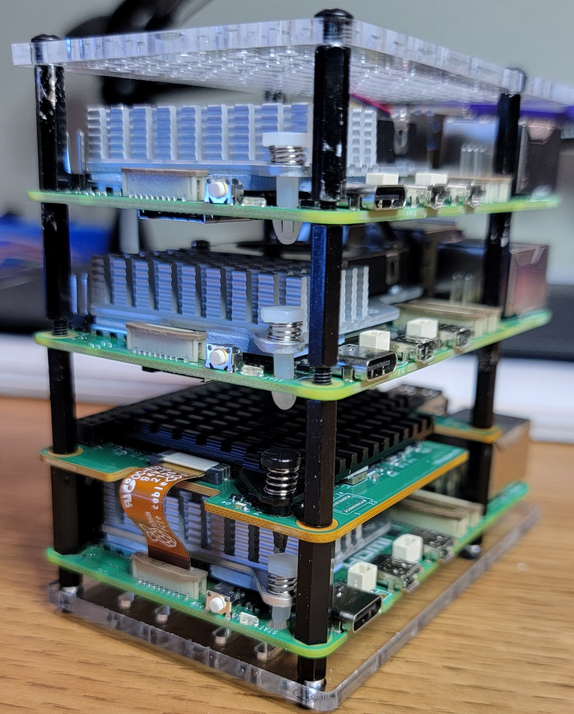

# Pi Cluster LLM

A 3-node Raspberry Pi 5 cluster for running local LLM inference, with a Hailo AI HAT+ for hardware-accelerated edge AI.

<p align="center">
  
</p>

## Goals

- **LLM Runtime** -- Run large language models locally on Pi hardware, both CPU-based and NPU-accelerated
- **Distributed Inference** -- Split models across multiple nodes to run larger models than a single Pi can handle
- **Orchestration** -- Route requests to the right backend based on task complexity
- **Learn LLM Internals** -- Understand transformer architecture, quantization, and fine-tuning
- **Reinforcement Learning** -- Train a robot spider to walk using RL policies deployed on a Pi

## Hardware

| Node | Host | Hardware | RAM |
|------|------|----------|-----|
| Pi #1 | control.local | Raspberry Pi 5 + AI HAT+ (Hailo-10H, 40 TOPS) | 16GB + 8GB on-HAT |
| Pi #2 | worker1.local | Raspberry Pi 5 | 16GB |
| Pi #3 | worker2.local | Raspberry Pi 5 | 16GB |

## Status

| Phase | Target | Status |
|-------|--------|--------|
| [00 - Mac Setup](00-setup/) | Mac | ✅ Ansible and sshpass installed |
| [10 - OS Setup](10-os-setup/) | All Pis | ✅ Shell config, tools (lsof, jq), PCIe Gen 3 enabled on control |
| [20 - Hailo Setup](20-hailo-setup/) | Control | ✅ hailo-h10-all installed, hailo_pci blacklisted, device verified at `/dev/hailo0` |
| [30 - Monitor Setup](30-monitor-setup/) | All Pis | ✅ pi-agent running on port 8765 |

## Dashboards

| Node | Dashboard | URL |
|------|-----------|-----|
| control | pi-agent | http://control.local:8765 |
| worker1 | pi-agent | http://worker1.local:8765 |
| worker2 | pi-agent | http://worker2.local:8765 |

## Getting Started

### 1. Flash SD cards

```bash
make flash-sd name=control
make flash-sd name=worker1
make flash-sd name=worker2
```

Each card is pre-configured with WiFi credentials (from the Ansible vault), hostname, and SSH key. The Pis connect to WiFi on first boot and are reachable via `.local` hostnames — no static IPs or ethernet required.

See [00-setup/README.md](00-setup/README.md) for vault and sudoers prerequisites.

### 2. Provision

```bash
make os-setup
make hailo-setup
make k3s-setup
```

See [plan.md](plan.md) for the full setup plan and [models.md](models.md) for installed Hailo models.

## Monitoring

Install the `pi-monitor` CLI to view live data from all nodes:

```bash
: brew install esumerfd/pi-cluster-monitor/pi-monitor
: pi-monitor --inventory inventory.yml
```

## References

- [AI HAT+ Documentation](https://www.raspberrypi.com/documentation/accessories/ai-hat-plus.html)
- [Raspberry Pi AI Software](https://www.raspberrypi.com/documentation/computers/ai.html)
- [Hailo-10H Web Dashboard](https://github.com/kristoffersingleton/RPI-Hailo-10H-Web-Dashboard)
- [RaspiDash System Monitor](https://github.com/kristoffersingleton/raspi-dash)
- [Hailo Model Zoo](https://github.com/hailo-ai/hailo_model_zoo)
- [Frigate with Hailo for object detection on a Raspberry Pi](https://www.jeffgeerling.com/blog/2026/frigate-with-hailo-for-object-detection-on-a-raspberry-pi)
